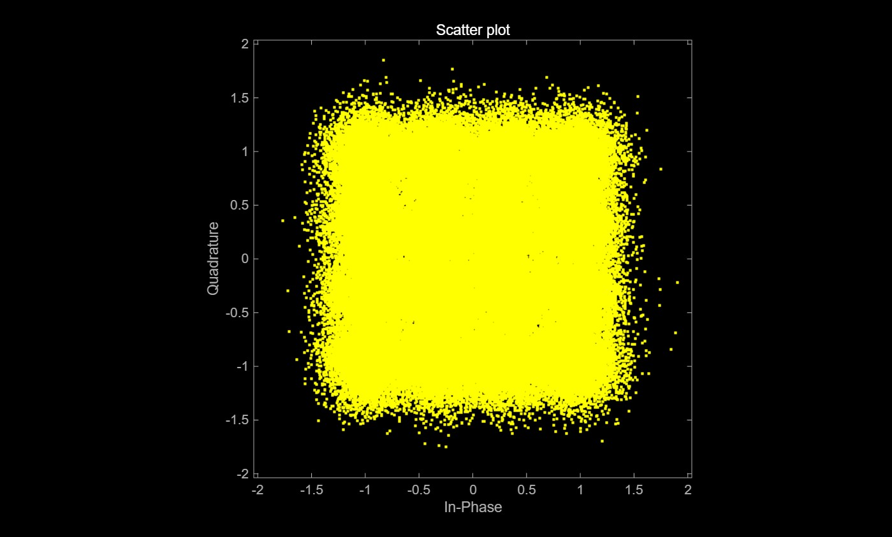
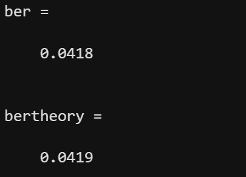
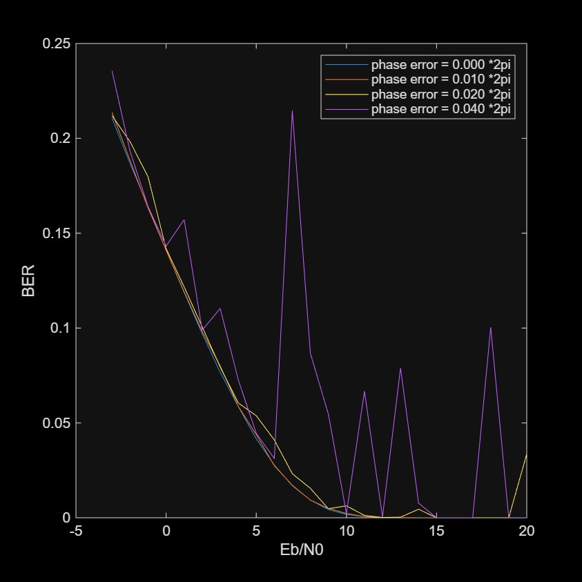

16-QAM Demodulation  
  
1. 랜덤비트생성 -> 16QAM변조 ->노이즈 추가 ->qamdemod -> BER이론값&BER비교  
2. 랜덤비트생성 -> 16QAM변조 -> 심볼회전 -> 노이즈추가 -> qamdemod->BER비교  
  
  
Result  
심볼  
 \
실제 BER 값 VS 이론값  
 \
 \
  

Lab6: 메인스크립트
