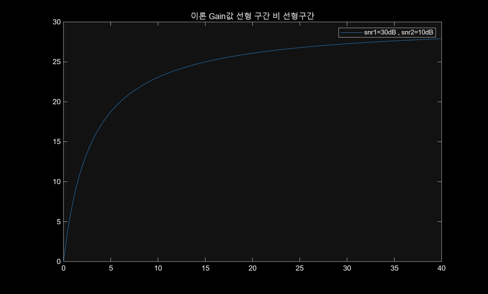
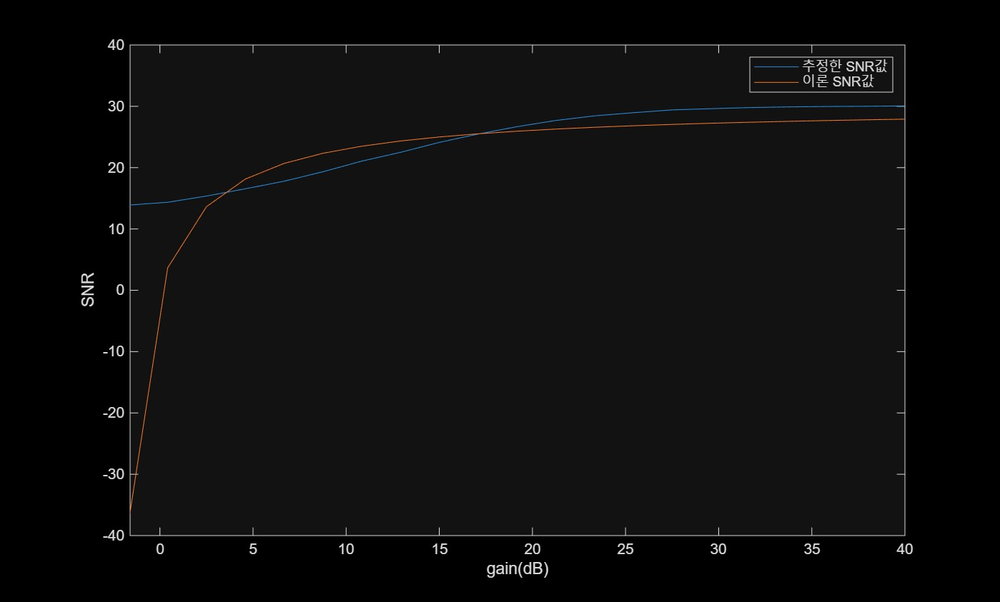
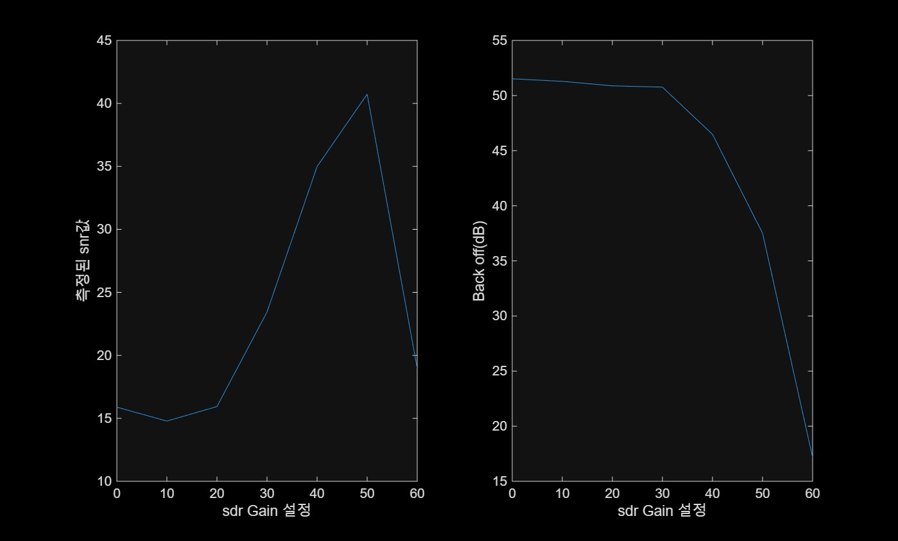

Gain Control 모델  

Gain vs SNR을 이론모델과 h추정모델과 비교  

결과    
  
  
  
수신backoff가 낮을수록 좋고 SNR이높을수록 좋다

Lab7: 메인스크립트  
estChanResp: (R=HX)추정채널h에서 짧은구간은 샘플전력 나머지구간은 노이즈전력으로 SNR계산  
plutoCreateTxR  : SDR송수신 객체 생성  
