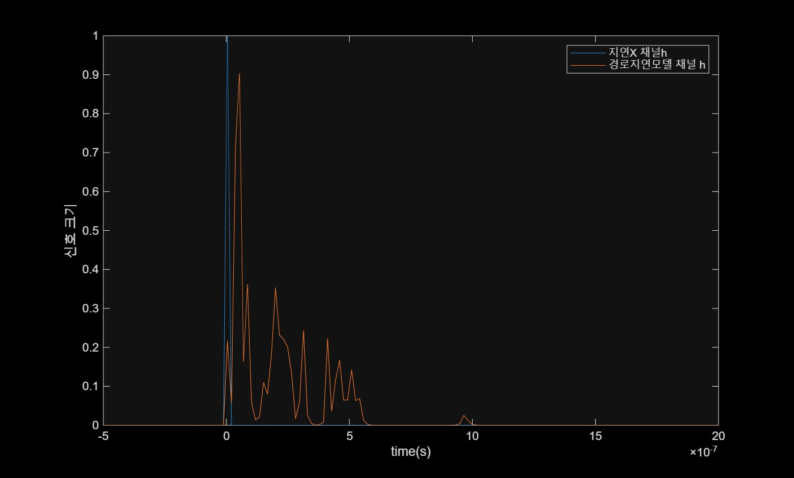
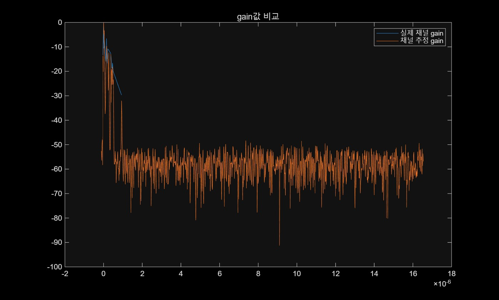

 멀티 경로 랜덤 지연  채널 시뮬레이션  

1.채널구현에 nrTDLChannel함수 사용(3GPP의 TDL 모델) -> 다중경로 채널h 구현-> OFDM심볼로 채널h추정(나누기)   
2.SDR 루프백 채널h추정  
  
채널설정 h로 구현하는법  
 1. 임펄스함수만들어서 샘플지연 -> gain적용후 각 합 으로 총채널h만듬  
 2. sinc함수만들어서 분수지연 conv (h,x) -> 정수지연 -> gain적용 (1경로 신호 일경우)
\
결과

 \
루프백채널 h 에서 \
피크가 항상 <0dB 가 아닌 +30dB인이유 :   추정채널H를 ifft->h 를 RMS 정규화 \
 				                                  정규화과정에서 h_peak의 ||.^2 이 거의 N으로맞춰짐 \
				                                   10log(1024) -> 항상 30.1dB \
				                                   즉, 정규화와 샘플갯수 때문 \

\
Lab3.m: 메인스크립트 \
estChanResp.m: \
plutCreateTxRx.m: SDR 송수신 객체생성 \
SISOChan.m: 임펄스 신호를받고 각경로마다 샘플지연과 gain을 적용한 후 합해서  채널h를 만듬 \
estChanResp.m: OFDM신호를 이용한 채널추정 \
TxFilt.m: 업샘플링  & 대역폭제한 필터 \
